# Eagle Analytics - Next Generation Project Overview

## Executive Summary

Eagle Analytics Next Generation represents a complete architectural revolution from the current system, transforming it into a fully revamped, multi-tenant, dynamically configurable industrial analytics platform. This next-generation system addresses all limitations of the current implementation by introducing advanced Role-Based Access Control (RBAC), dynamic configuration capabilities, super admin management, and a modern technology stack built for enterprise-scale scalability and flexibility.

### Key Transformation Highlights

- **Technology Revolution**: Complete migration from Angular to Next.js 14+ with React 18+
- **Multi-Tenant Architecture**: Advanced tenant isolation with dynamic configuration per tenant
- **Dynamic Configuration System**: No-code configuration interface for super admins
- **Advanced RBAC**: Granular permission system with dynamic role management
- **Modern Backend**: ASP.NET Core 8 with Entity Framework Core 8
- **Enterprise Scalability**: Built for cloud deployment with microservices architecture
- **Real-time Capabilities**: Enhanced real-time monitoring with SignalR integration
- **Advanced Analytics**: Dynamic formula engine and custom metric creation

## System Architecture Overview

### High-Level Architecture

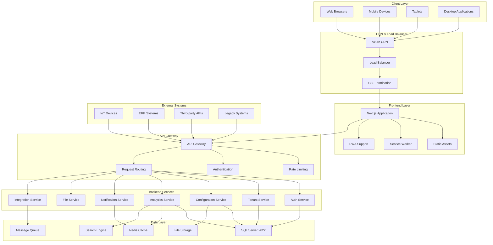

### Multi-Tenant Architecture

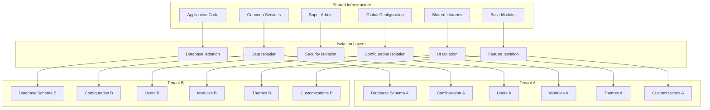

## Technology Stack Revolution

### Frontend Technology Stack

#### Core Framework and Routing
- **Next.js 14+**: React-based framework with App Router for optimal performance
- **React 18+**: Modern React with concurrent features and Suspense
- **TypeScript 5+**: Type-safe development with advanced type features
- **App Router**: Next.js file-based routing system with dynamic routes

#### State Management and Data Fetching
- **Zustand**: Lightweight, scalable state management
- **TanStack Query v5**: Server state management with intelligent caching
- **Axios**: HTTP client with interceptors and request/response handling

#### UI and Styling
- **TailwindCSS**: Utility-first CSS framework for rapid development
- **Headless UI**: Accessible component primitives
- **Radix UI**: Low-level UI primitives for custom components
- **Framer Motion**: Advanced animation library
- **Lucide React**: Modern, customizable icon library

#### Forms and Validation
- **React Hook Form**: Performant form handling with minimal re-renders
- **Zod**: TypeScript-first schema validation
- **@hookform/resolvers**: Form validation resolvers integration

#### Testing Framework
- **Jest**: JavaScript testing framework
- **React Testing Library**: Testing utilities for React components
- **Playwright**: End-to-end testing for modern web apps
- **MSW**: Mock Service Worker for API mocking

#### Development Tools
- **ESLint**: Code linting and quality enforcement
- **Prettier**: Code formatting and consistency
- **Husky**: Git hooks for pre-commit validation
- **Lint-staged**: Pre-commit hooks for staged files

### Backend Technology Stack

#### Core Framework
- **ASP.NET Core 8**: Modern, cross-platform .NET framework
- **Entity Framework Core 8**: Object-relational mapping with performance optimizations
- **C# 12**: Latest language features and performance improvements

#### Authentication and Authorization
- **ASP.NET Core Identity**: Comprehensive user management system
- **JWT Bearer**: Token-based authentication with refresh tokens
- **Custom Authorization Handlers**: Dynamic permission system
- **Azure AD Integration**: Enterprise authentication (optional)

#### API and Communication
- **RESTful APIs**: Standard HTTP APIs with OpenAPI documentation
- **SignalR**: Real-time communication for live updates
- **Swagger/OpenAPI**: Comprehensive API documentation
- **AutoMapper**: Object mapping for DTOs
- **FluentValidation**: Input validation and business rules

#### Data and Caching
- **SQL Server 2022**: Primary database with advanced features
- **Redis**: Distributed caching and session storage
- **Elasticsearch**: Search and analytics engine (optional)
- **Azure Service Bus**: Message queuing for async operations (optional)

#### Monitoring and Logging
- **Serilog**: Structured logging with multiple sinks
- **Application Insights**: Performance monitoring and telemetry
- **Health Checks**: System health monitoring and reporting

## Advanced Authentication & Authorization System

### Multi-Factor Authentication Flow

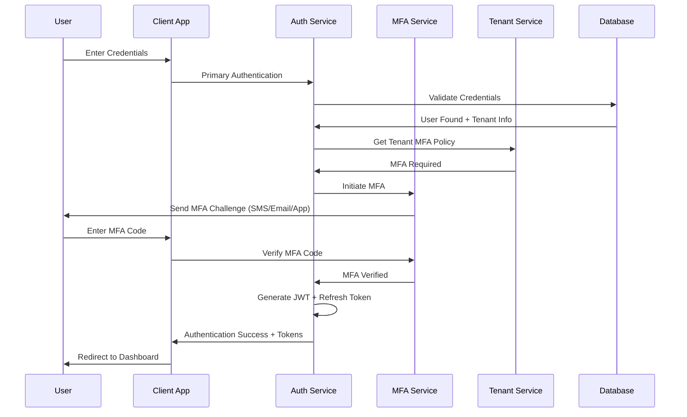

### Advanced RBAC Architecture

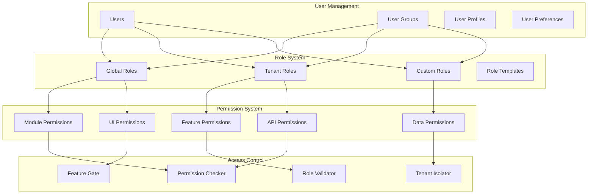

### Session Management & Security

```mermaid
graph LR
    subgraph "Session Creation"
        SC1[User Login]
        SC2[Token Generation]
        SC3[Session Storage]
        SC4[Device Registration]
    end
    
    subgraph "Session Validation"
        SV1[Token Validation]
        SV2[Permission Check]
        SV3[Tenant Validation]
        SV4[Security Policies]
    end
    
    subgraph "Session Management"
        SM1[Active Sessions]
        SM2[Session Timeout]
        SM3[Concurrent Sessions]
        SM4[Session Revocation]
    end
    
    subgraph "Security Features"
        SF1[Rate Limiting]
        SF2[IP Whitelisting]
        SF3[Device Fingerprinting]
        SF4[Audit Logging]
    end
    
    SC1 --> SC2
    SC2 --> SC3
    SC3 --> SC4
    SC4 --> SV1
    SV1 --> SV2
    SV2 --> SV3
    SV3 --> SV4
    SV4 --> SM1
    SM1 --> SM2
    SM2 --> SM3
    SM3 --> SM4
    SM4 --> SF1
    SF1 --> SF2
    SF2 --> SF3
    SF3 --> SF4
```

### Authentication Models

The system implements comprehensive authentication models including:

- **Multi-Factor Authentication**: SMS, Email, Authenticator App support
- **Social Login Integration**: Azure AD, Google, Microsoft 365
- **Biometric Authentication**: Fingerprint, Face ID support
- **Device Management**: Device registration and validation
- **Session Security**: JWT tokens with refresh token rotation
- **Audit Trail**: Comprehensive login/logout tracking
- **Security Policies**: Configurable password policies and lockout rules

## Dynamic Configuration System

### Configuration Management Architecture

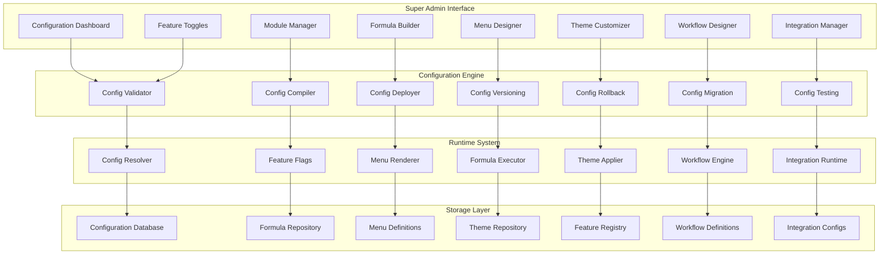

### No-Code Configuration Interface

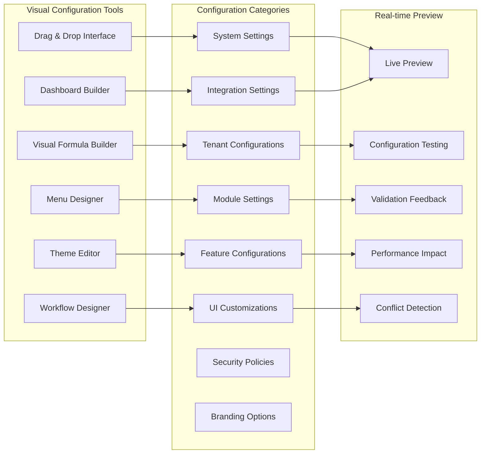

### Dynamic Formula Engine

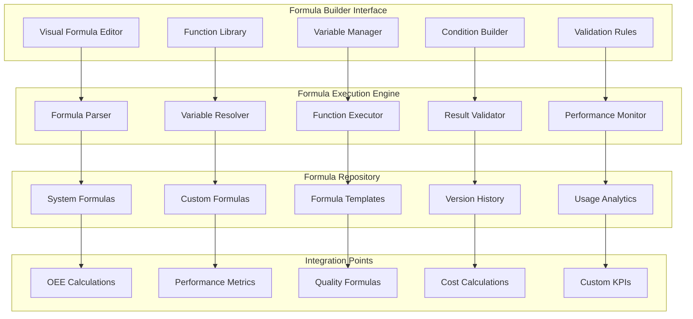

### Configuration Capabilities

The dynamic configuration system provides unprecedented flexibility:

- **Module Management**: Enable/disable modules per tenant
- **Feature Toggles**: Granular feature control
- **Custom Formulas**: Visual formula builder for calculations
- **Menu Customization**: Dynamic menu generation
- **Theme Management**: Brand-specific themes and styling
- **Workflow Configuration**: Visual workflow designer
- **Integration Setup**: No-code integration configuration
- **Security Policies**: Tenant-specific security rules
- **Branding Options**: Custom logos, colors, and layouts
- **Performance Tuning**: Configurable caching and optimization

## Enhanced Core Modules

### 1. OEE Analytics Module

#### Module Architecture

```mermaid
graph TB
    subgraph "OEE Analytics Module"
        OA1[OEE Dashboard]
        OA2[Real-time Monitoring]
        OA3[Production Analysis]
        OA4[Performance Trends]
        OA5[Custom Formula Engine]
        OA6[Loading/Unloading Tracking]
        OA7[Advanced Analytics]
        OA8[Predictive Insights]
    end
    
    subgraph "Data Sources"
        DS1[Machine Data]
        DS2[Production Data]
        DS3[Quality Data]
        DS4[Downtime Data]
        DS5[Schedule Data]
        DS6[Energy Data]
        DS7[Maintenance Data]
    end
    
    subgraph "Calculation Engine"
        CE1[Availability Calculator]
        CE2[Performance Calculator]
        CE3[Quality Calculator]
        CE4[OEE Aggregator]
        CE5[Custom Formula Executor]
        CE6[Trend Analyzer]
        CE7[Predictive Engine]
    end
    
    subgraph "Visualization Layer"
        VL1[Real-time Charts]
        VL2[Historical Trends]
        VL3[Comparison Views]
        VL4[KPI Cards]
        VL5[Heat Maps]
        VL6[3D Visualizations]
        VL7[Interactive Dashboards]
    end
    
    DS1 --> CE1
    DS2 --> CE2
    DS3 --> CE3
    DS4 --> CE1
    DS5 --> CE2
    DS6 --> CE2
    DS7 --> CE1
    
    CE1 --> CE4
    CE2 --> CE4
    CE3 --> CE4
    CE5 --> CE4
    CE6 --> CE4
    CE7 --> CE4
    
    CE4 --> VL1
    CE4 --> VL2
    CE4 --> VL3
    CE4 --> VL4
    CE4 --> VL5
    CE4 --> VL6
    CE4 --> VL7
    
    OA1 --> VL1
    OA2 --> VL1
    OA3 --> VL2
    OA4 --> VL3
    OA5 --> CE5
    OA6 --> CE1
    OA7 --> CE6
    OA8 --> CE7
```

#### Enhanced OEE Features

The OEE module has been completely revamped with:

- **Dynamic Formula Engine**: Visual formula builder for custom calculations
- **Real-time Monitoring**: Live OEE updates with SignalR integration
- **Advanced Analytics**: Machine learning-powered insights
- **Predictive Maintenance**: AI-driven maintenance predictions
- **Custom KPIs**: Tenant-specific performance indicators
- **Multi-dimensional Analysis**: Time, machine, product, and shift analysis
- **Automated Reporting**: Scheduled and on-demand report generation
- **Mobile Optimization**: Responsive design for mobile devices

### 2. Energy Management Module

#### Energy Analytics Architecture

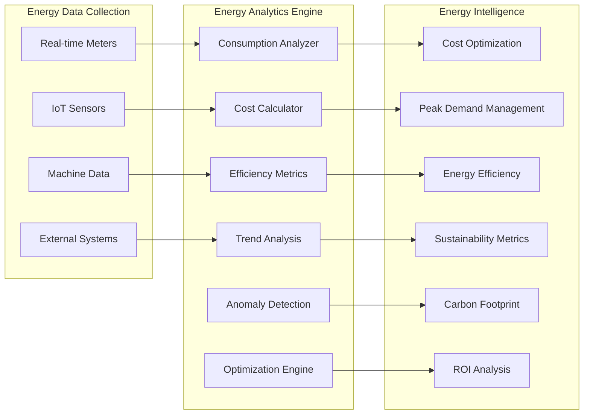

### 3. Machine Monitoring Module

#### Real-time Machine Intelligence

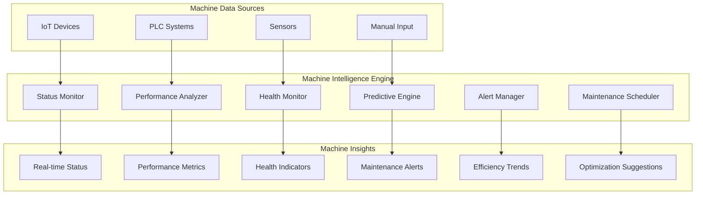

### 4. Quality Management Module

#### Advanced Quality Control

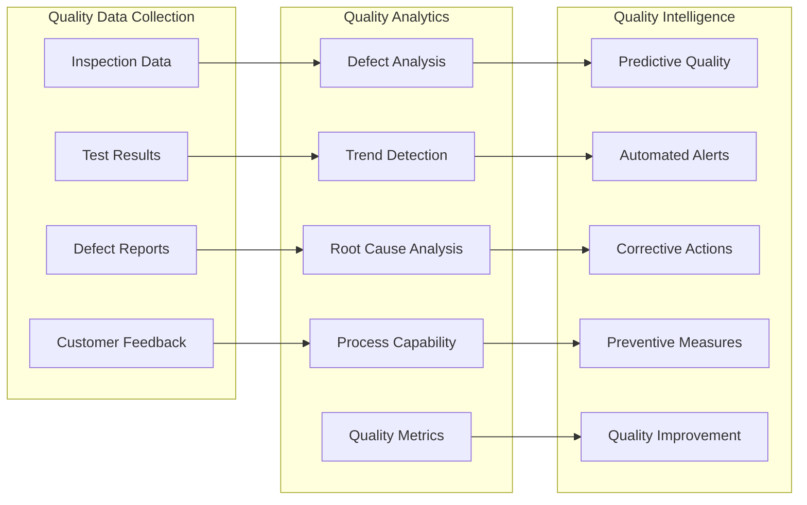

## Database Architecture & API Design

### Multi-Tenant Database Schema

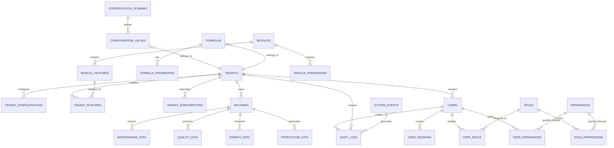

### API Architecture

#### RESTful API Design

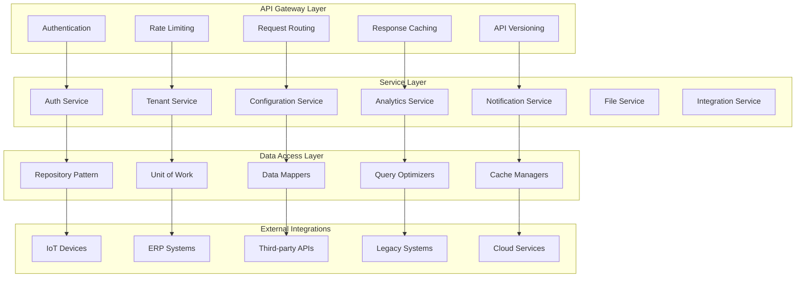

#### Real-time Communication

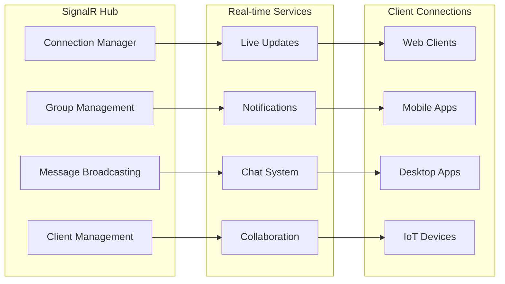

### Frontend Architecture

#### Next.js App Structure

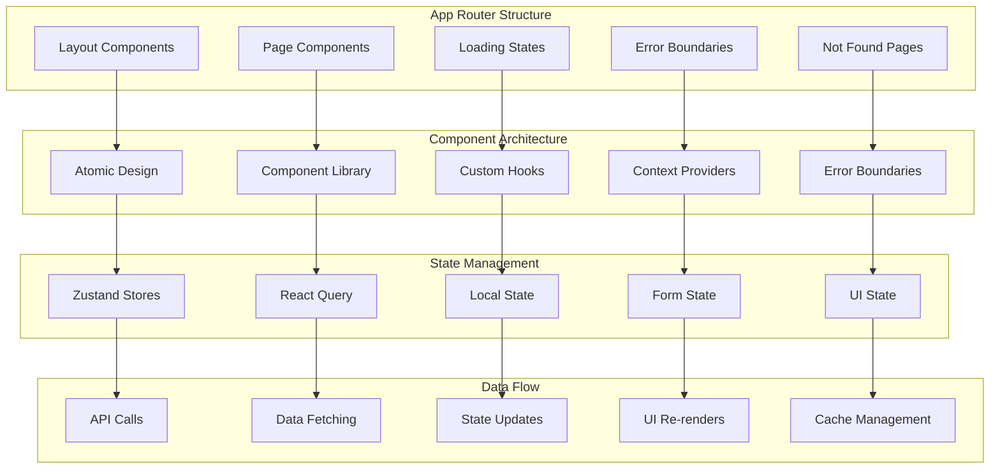

### Key Architectural Features

- **Multi-tenant Database Design**: Complete tenant isolation with shared infrastructure
- **Microservices Architecture**: Scalable service-based architecture
- **Real-time Communication**: SignalR integration for live updates
- **API-First Design**: RESTful APIs with comprehensive documentation
- **Caching Strategy**: Multi-layer caching with Redis and in-memory
- **Security by Design**: JWT authentication with role-based access control
- **Performance Optimization**: Query optimization and database indexing
- **Scalability**: Horizontal scaling with load balancing support

## Deployment & Operational Excellence

### Multi-Environment Strategy

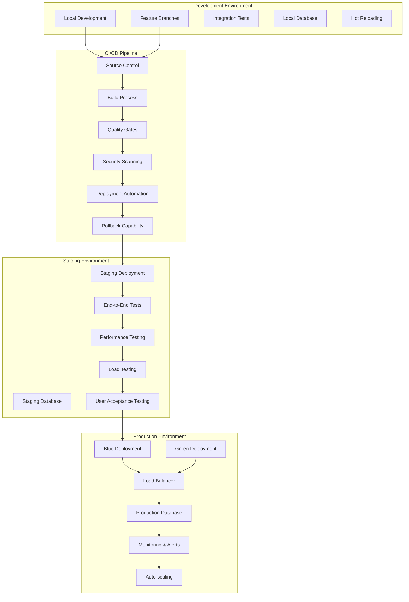

### Infrastructure as Code

#### Containerization Strategy

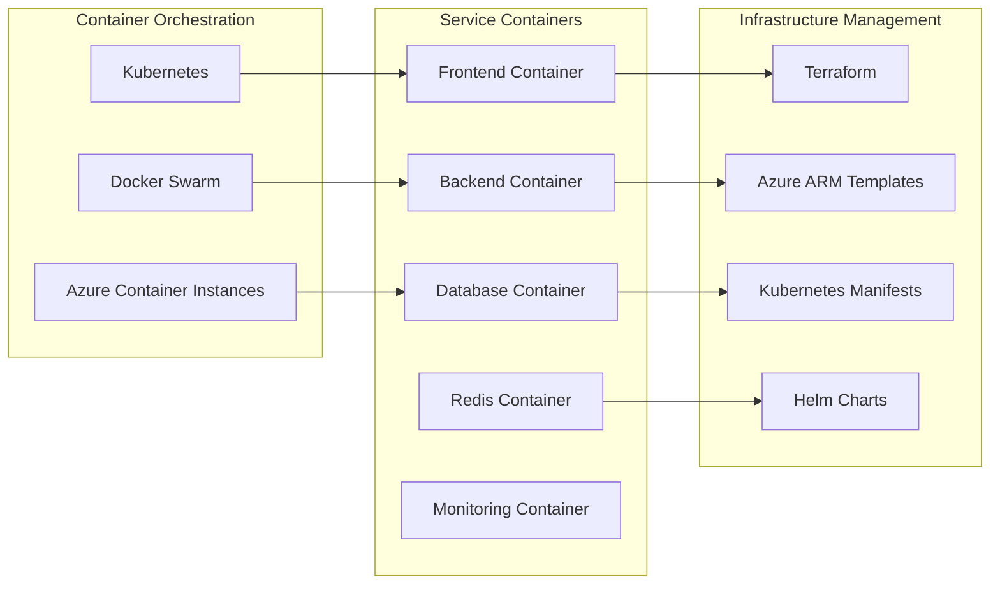

### Testing Strategy

#### Comprehensive Testing Approach

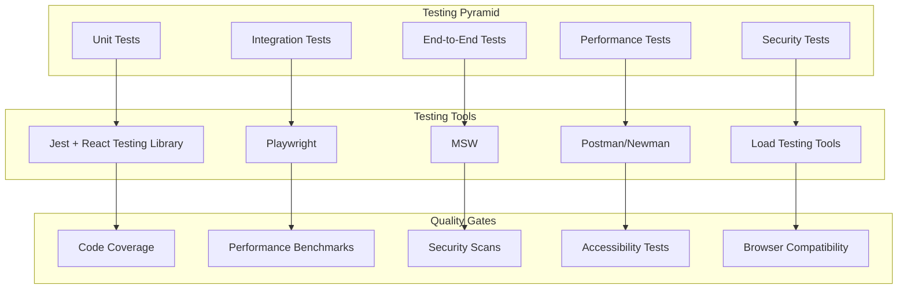

### Monitoring & Observability

#### Comprehensive Monitoring Stack

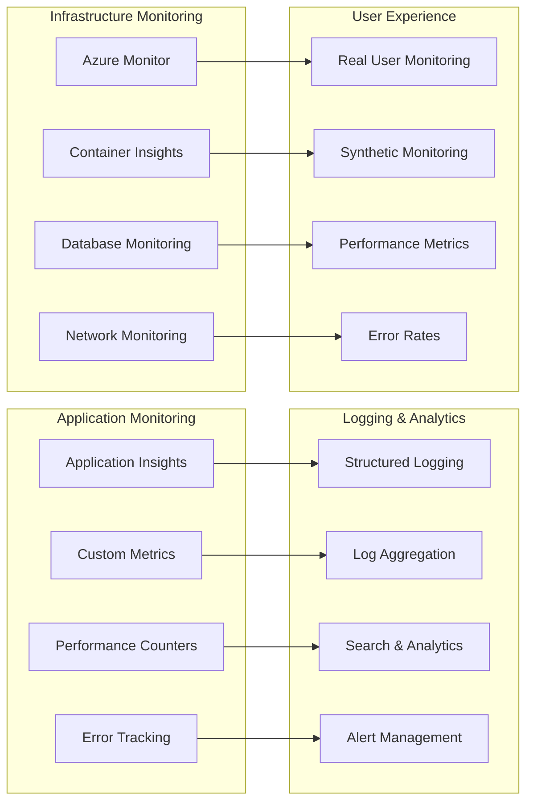

### Security & Compliance

#### Security Architecture

```mermaid
graph TD
    subgraph "Security Layers"
        SL1[Network Security]
        SL2[Application Security]
        SL3[Data Security]
        SL4[Identity Security]
    end
    
    subgraph "Security Measures"
        SM1[Firewall & WAF]
        SM2[Input Validation]
        SM3[Encryption at Rest]
        SM4[Multi-Factor Auth]
        SM5[Role-Based Access]
        SM6[Audit Logging]
    end
    
    subgraph "Compliance Features"
        CF1[GDPR Compliance]
        CF2[Data Privacy]
        CF3[Audit Trails]
        CF4[Data Retention]
        CF5[Access Controls]
    end
    
    SL1 --> SM1
    SL2 --> SM2
    SL3 --> SM3
    SL4 --> SM4
    
    SM1 --> CF1
    SM2 --> CF2
    SM3 --> CF3
    SM4 --> CF4
    SM5 --> CF5
    SM6 --> CF3
```

## Key Benefits & Value Proposition

### Business Value

- **Operational Excellence**: Real-time monitoring and predictive analytics
- **Cost Optimization**: Energy management and maintenance optimization
- **Quality Improvement**: Advanced quality control and defect prevention
- **Compliance**: Comprehensive audit trails and regulatory compliance
- **Scalability**: Multi-tenant architecture supporting business growth

### Technical Advantages

- **Modern Technology Stack**: Latest frameworks and tools for optimal performance
- **Cloud-Native Design**: Built for cloud deployment and scalability
- **Real-time Capabilities**: Live updates and instant notifications
- **Security First**: Enterprise-grade security and compliance
- **Developer Experience**: Modern development tools and practices

### Competitive Advantages

- **No-Code Configuration**: Super admin capabilities without development
- **Multi-tenant Architecture**: Efficient resource utilization
- **Dynamic Customization**: Tailored solutions for each tenant
- **Advanced Analytics**: AI-powered insights and predictions
- **Enterprise Ready**: Built for large-scale industrial operations

## Conclusion

Eagle Analytics Next Generation represents a paradigm shift in industrial analytics platforms, combining cutting-edge technology with unprecedented flexibility and scalability. The system addresses all limitations of the current implementation while introducing advanced capabilities that position it as a market-leading solution for modern manufacturing operations.

The comprehensive architecture, advanced security, dynamic configuration capabilities, and modern technology stack make this system not just an upgrade, but a complete transformation that will drive operational excellence and competitive advantage for years to come.
